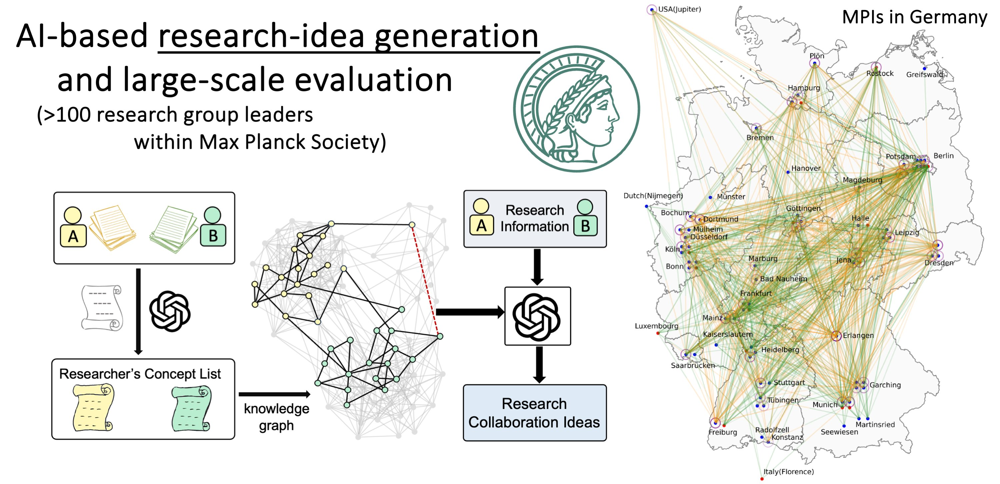

# SciMuse

### How interesting are AI-generated research ideas to experienced human researchers, and how can we improve their quality?

📖 <u> Read our paper here: </u>\
[**Interesting Scientific Idea Generation Using Knowledge Graphs and LLMs: Evaluations with 100 Research Group Leaders**](https://arxiv.org/abs/2405.17044)\
*[Xuemei Gu](mailto:xuemei.gu@mpl.mpg.de), [Mario Krenn](mailto:mario.krenn@mpl.mpg.de)*

> [!NOTE]\
> Full Dynamic Knowledge Graph can be downloaded at [10.5281/zenodo.13900962](https://doi.org/10.5281/zenodo.13900962)

## Concept Extraction
1. Initial Concept Extraction:
We analyzed the titles and abstracts of approximately 2.44 million papers from four preprint datasets using the RAKE algorithm, enhanced with additional stopwords, to extract potential concept candidates.
- Initial filtering retained two-word concepts appearing in at least nine articles.
- Concepts with more than three words were retained if they appeared in six or more articles. 

2. Quality Improvement: To enhance the quality of identified concepts, we implemented a suite of automated tools to address domain-independent errors commonly associated with RAKE. We then manually reviewed and removed inaccuracies such as non-conceptual phrases, verbs, and conjunctions. For further details, refer to the [Impact4Cast Paper](https://arxiv.org/abs/2402.08640) and our [GitHub code for concept extraction](https://github.com/artificial-scientist-lab/Impact4Cast/tree/main/create_concepts).

3. Further Refinement with GPT:
We used GPT-3.5 to refine the concepts further, which resulted in the removal of 286,311 entries. Using Wikipedia, we restored 40,614 mistakenly removed entries, resulting in a final, refined list of 123,128 concepts. For details on prompt engineering, refer to the appendix of the [SciMuse paper](https://arxiv.org/abs/2405.17044).

The code for generating and refining concepts in this repository:
[GitHub - Impact4Cast Concept Extraction](https://github.com/artificial-scientist-lab/Impact4Cast/tree/main/create_concepts).

## Files in this repository
<pre>
.
├── <a href="https://github.com/artificial-scientist-lab/SciMuse/tree/main/data">data</a>                                      # Directory containing datasets
│   ├── full_concepts.txt                     # Full concept list
│   ├── all_evaluation_data.pkl               # Human evaluation dataset
│   ├── full_data_ML.pkl                      # Dataset for supervised neural networks (from create_full_data_ML_pkl.py)
│   ├── full_data_gpt35.pkl                   # Dataset for GPT-3.5 (from create_full_data_gpt_pkl.py)
│   ├── full_data_gpt4o.pkl                   # Dataset for GPT-4o (from create_full_data_gpt_pkl.py)
│   ├── full_data_gpt4omini.pkl               # Dataset for GPT-4omini
│   ├── full_data_DT_fixed_params.pkl         # Dataset for Decision tree
│   ├── elo_data_gpt35.pkl                    # ELO ranking data for GPT-3.5 (from create_full_data_gpt_pkl.py)
│   ├── elo_data_gpt4o.pkl                    # ELO ranking data for GPT-4o (from create_full_data_gpt_pkl.py)
│   ├── combined_ELO_results_35.txt           # ELO results for GPT-3.5
│   ├── combined_ELO_results_4omini.txt       # ELO results for GPT-4omini
│   └── combined_ELO_results_4o.txt           # ELO results for GPT-4o
│
├── <a href="https://github.com/artificial-scientist-lab/SciMuse/tree/main/figures">figures</a>                                   # Directory for storing generated figures
│
├── create_fig3.py                            # Analysis of interest levels vs. knowledge graph features (for Fig. 3)
├── create_full_data_ML_pkl.py                # Code for generating supervised ML dataset (full_data_ML.pkl)
├── create_full_data_gpt_pkl.py               # Code for generating GPT datasets (full_data_gpt35.pkl, full_data_gpt4o.pkl, etc.)
├── create_fig4.py                            # Predicting scientific interest and generating Fig. 4
├── create_figs_withTree.py                   # Predicting scientific interest and generating Fig4 with Decision tree in the SI
│
└── Fig_AUC_over_time.py                      # Zero-shot ranking of research suggestions by LLMs (for Fig. 6)
</pre>
