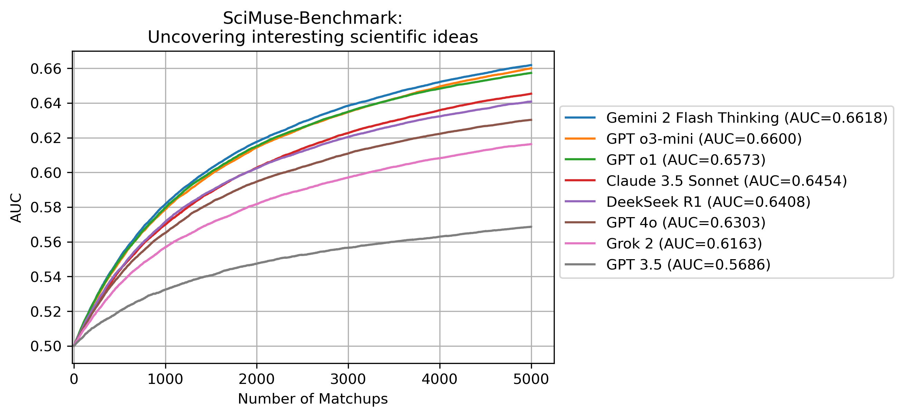

# SciMuse

### How interesting are AI-generated research ideas to experienced human researchers, and how can we improve their quality?

📖 <u> Read our paper here: </u>\
[**Interesting Scientific Idea Generation Using Knowledge Graphs and LLMs: Evaluations with 100 Research Group Leaders**](https://arxiv.org/abs/2405.17044)\
*[Xuemei Gu](mailto:xuemei.gu@mpl.mpg.de), [Mario Krenn](mailto:mario.krenn@mpl.mpg.de)*

> [!NOTE]\
> Full Dynamic Knowledge Graph can be downloaded at [10.5281/zenodo.13900962](https://doi.org/10.5281/zenodo.13900962)

## The SciMuse benchmark

<b>The SciMuse Benchmark tests how well a model can predict expert humans' ranking of the scientific interest of personalized research ideas.</b> The higher the model's quality, the better it can predict what experts consider interesting ideas. Ultimately, models with high scores can be used to rank millions of ideas and select a few exceptionally exciting interdisciplinary ideas that could vastly accelerate scientific progress — that is the dream.

In the paper, we have nearly 3,000 personalized <i>scientific ideas</i> ranked by more than 100 highly experienced research group leaders (in the fields of biology, chemistry, physics, computer science, math, and humanities). The goal of the SciMuse Benchmark is to rank the 3,000 ideas from most interesting to least interesting. To evaluate, we use the AUC of a binary classification task that separates the ideas into high-interest and low-interest categories.

To achieve this, we establish an ELO ranking for each idea by simulating many matchups between randomly chosen pairs of ideas. In each matchup, the LLM is given two ideas along with five papers from the corresponding researchers, A and B. The LLM then estimates whether researcher A ranked their idea higher than researcher B's. The final ELO ranking is used, together with the ground truth, to compute the AUC. The final result is computed by an average over 100 random shufflings of the matchup orders.

For privacy reasons, both the research questions and the expert-human rankings are private. Thus, this benchmark cannot be part of any training dataset of the models. If you want to help testing other models for the benchmark, please write to us ([Xuemei Gu](mailto:xuemei.gu@mpl.mpg.de), [Mario Krenn](mailto:mario.krenn@mpl.mpg.de)). We will need API access to your model for 5000 calls or (ideally) more.

The curves clearly do not converge yet, meaning the final AUC for infinite matchups (and thus the ultimate AUC of the model) is higher than the ones at 5000 matchups. However, due to costly execution, we did not run some of the models for more matchups (specifically, the GPT o1 evaluation costs roughly $300). In any case, the AUC at 5000 matchups is a lower limit of the final AUC and clearly distinguishes the quality of the different models.

## Concept Extraction
1. Initial Concept Extraction:
We analyzed the titles and abstracts of approximately 2.44 million papers from four preprint datasets using the RAKE algorithm, enhanced with additional stopwords, to extract potential concept candidates.
- Initial filtering retained two-word concepts appearing in at least nine articles.
- Concepts with more than three words were retained if they appeared in six or more articles. 

2. Quality Improvement: To enhance the quality of identified concepts, we implemented a suite of automated tools to address domain-independent errors commonly associated with RAKE. We then manually reviewed and removed inaccuracies such as non-conceptual phrases, verbs, and conjunctions. For further details, refer to the [Impact4Cast Paper](https://arxiv.org/abs/2402.08640) and our [GitHub code for concept extraction](https://github.com/artificial-scientist-lab/Impact4Cast/tree/main/create_concepts).

3. Further Refinement with GPT:
We used GPT-3.5 to refine the concepts further, which resulted in the removal of 286,311 entries. Using Wikipedia, we restored 40,614 mistakenly removed entries, resulting in a final, refined list of 123,128 concepts. For details on prompt engineering, refer to the appendix of the [SciMuse paper](https://arxiv.org/abs/2405.17044).

The code for generating and refining concepts in this repository:
[GitHub - Impact4Cast Concept Extraction](https://github.com/artificial-scientist-lab/Impact4Cast/tree/main/create_concepts).

## Files in this repository
<pre>
.
├── <a href="https://github.com/artificial-scientist-lab/SciMuse/tree/main/data">data</a>                                      # Directory containing datasets
│   ├── full_concepts.txt                     # Full concept list
│   ├── all_evaluation_data.pkl               # Human evaluation dataset
│   ├── full_data_ML.pkl                      # Dataset for supervised neural networks (from create_full_data_ML_pkl.py)
│   ├── full_data_gpt35.pkl                   # Dataset for GPT-3.5 (from create_full_data_gpt_pkl.py)
│   ├── full_data_gpt4o.pkl                   # Dataset for GPT-4o (from create_full_data_gpt_pkl.py)
│   ├── full_data_gpt4omini.pkl               # Dataset for GPT-4omini
│   ├── full_data_DT_fixed_params.pkl         # Dataset for Decision tree
│   ├── elo_data_gpt35.pkl                    # ELO ranking data for GPT-3.5 (from create_full_data_gpt_pkl.py)
│   ├── elo_data_gpt4o.pkl                    # ELO ranking data for GPT-4o (from create_full_data_gpt_pkl.py)
│   ├── combined_ELO_results_35.txt           # ELO results for GPT-3.5
│   ├── combined_ELO_results_4omini.txt       # ELO results for GPT-4omini
│   └── combined_ELO_results_4o.txt           # ELO results for GPT-4o
│
├── <a href="https://github.com/artificial-scientist-lab/SciMuse/tree/main/figures">figures</a>                                   # Directory for storing generated figures
│
├── create_fig3.py                            # Analysis of interest levels vs. knowledge graph features (for Fig. 3)
├── create_full_data_ML_pkl.py                # Code for generating supervised ML dataset (full_data_ML.pkl)
├── create_full_data_gpt_pkl.py               # Code for generating GPT datasets (full_data_gpt35.pkl, full_data_gpt4o.pkl, etc.)
├── create_fig4.py                            # Predicting scientific interest and generating Fig. 4
├── create_figs_withTree.py                   # Predicting scientific interest and generating Fig4 with Decision tree in the SI
│
└── Fig_AUC_over_time.py                      # Zero-shot ranking of research suggestions by LLMs (for Fig. 6)
</pre>
